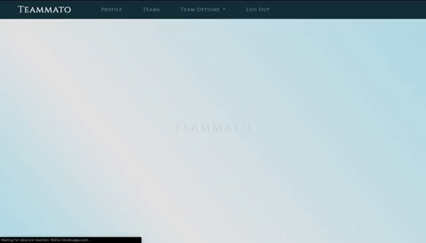
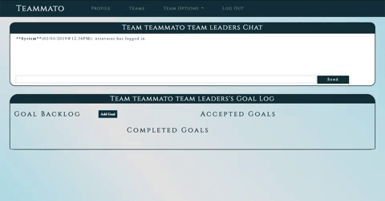
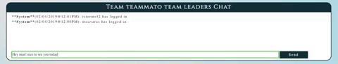
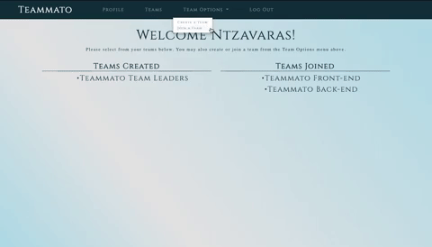

# Teammato

- [Live Demo](http://obscure-reaches-16352.herokuapp.com)

## Real Time Team Organization Tool

- Utilizes sockets to maintain a connection between the user and the server in order to push relevant changes to the data to the user without the need to refresh.

## Chat room functionality

- The chat room allows team members to communicate on the tasks they are doing. It also displays system messages in order to alert the user to anything they might have missed.

## Goal Workflow

- Functionality of the goals for a team

## Adding goals for Teams

- Team members can add goals for the team to accomplish

## Teams Lists

- Lists are sorted based on created or joined
